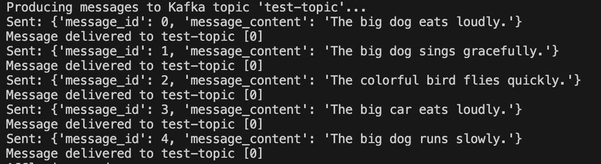

# mod3-spark

This folder contains Jupyter notebooks designed to explore the usage of **PySpark**, a powerful tool for distributed data processing.
Inside this repo you will find examples for both batch processing as well as streaming. Those are:
1. For batch we only use PySpark and you can find the notebook for this inside the folder `notebooks/batch_procssing`. Just follow the instructions below in order to have all the data needed for this process
2. For streaming, you can see the notebook inside the folder `notebooks/streaming_processing`. Under this folder you have:
    * `kafka_producer.py` - this is a simple Python script that will publish random messages into a Kafka Topic. The Kafka cluster will be created with the docker container configured with the `Dockerfile` and `docker-compose.yml` files. To run this producer, you need to 
        * run the container using [this instructions](#running_the_notebooks)
        * create a Python virtual environment, activate it and install the needed packages from `requirements.txt`
             ```bash 
             python -m venv .venv
             source .venv/bin/activate
             pip install -r requirements.txt
             ```
        * navigate to the folder `notebooks/streaming_processing` and run the script using
            ```bash
            python kafka_producer.py
            ```
        * you should start seeing messages flowing to the Kafka cluster
            
    * `streaming_processing.ipynb` - this is the notebook file that will have all the steps needed to connect with the Kafka cluster, consume the messages and then process them

# Getting Started

To run these notebooks, ensure you have the necessary dependencies installed and configured on your system.

## Prerequisites

1. **Install Docker**

2. **Download required data**:
   Run the next command to get the data needed for this exercise. If you don't have `wget` installed, follow the instructions below.
   ```bash
   wget https://d37ci6vzurychx.cloudfront.net/trip-data/fhvhv_tripdata_2023-01.parquet -P spark_data/
   ```

   ### **Install `wget` if needed**
   **macOS**<br>
   You can install `wget` using Homebrew:
   ```bash
   brew install wget
   ```

   **Linux**<br>
   On Debian-based distributions (like Ubuntu), install `wget` using:
   ```bash
   sudo apt-get update
   sudo apt-get install wget
   ```
   **Red Hat-based systems (like Fedora)**<br>
   ```bash
   sudo dnf install wget
   ```

   **Windows**<br>
   On Windows, install `wget` as part of Git Bash or through a third-party package manager like Chocolatey:
   ```bash
   choco install wget
   ```

## Running the Notebooks

1. Build the Docker container:
   ```bash
   docker-compose build --no-cache
    ```
2. Run the Docker container:
   ```bash
   docker-compose up -d
    ```
3. Open the following links to ensure everything is working properly<br>
[Jupyter Notebook](http://localhost:8888)<br>
[Spark Cluster UI](http://localhost:8080)